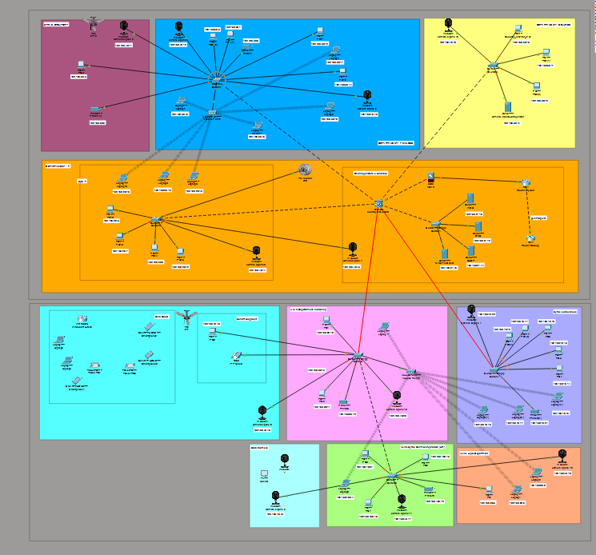

# 🌐 Corporate Network Design

A fully simulated corporate network infrastructure built in **Cisco Packet Tracer**, designed for a multi-department consultancy company. The network includes routing, switching, VLANs, and a structured IP addressing scheme.

---

## 🏢 Network Overview

The topology simulates a real-world corporate environment with:

- Multiple **departments** segmented using VLANs
- **Routers** handling inter-VLAN routing and WAN connectivity
- **Switches** managing internal LAN traffic per department
- A structured **IP addressing scheme** across all segments

---

## ⚙️ Technologies & Concepts Applied

| Concept | Details |
|---|---|
| VLANs | Department-level network segmentation |
| Inter-VLAN Routing | Router-on-a-stick or Layer 3 switching |
| IP Addressing | Subnetting across departments |
| Switching | Access and trunk port configuration |
| Routing | Static or dynamic routing between segments |

---

## 🗂️ File

| File | Description |
|---|---|
| `Detyre_3.pkt` | Cisco Packet Tracer project file — open with Packet Tracer 8.0+ |

---

## 🚀 Getting Started

### Prerequisites

- [Cisco Packet Tracer](https://www.netacad.com/courses/packet-tracer) 8.0 or later (free with a Cisco NetAcad account)

### Open the project

1. Download and install Cisco Packet Tracer
2. Open `Detyre_3.pkt` from within the application
3. Use **Simulation Mode** to trace packets and verify connectivity

---

## 🛠️ Built With

---

## 👩‍💻 Author

**Erjola Latifllari** — [GitHub](https://github.com/erjolalatifllari)